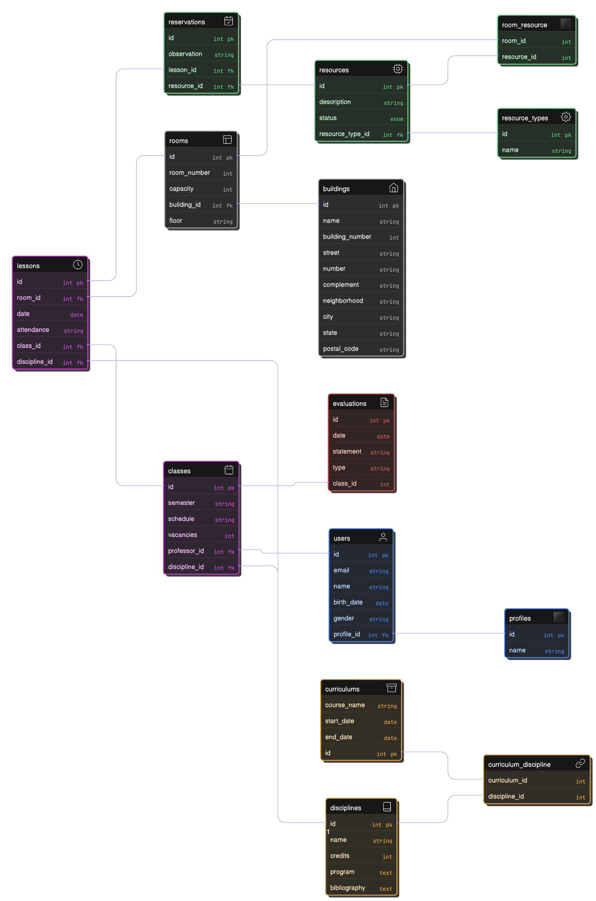

# csw24-grupoe-T1_CS-fastapi

Desenvolvimento do T1 da cadeira Construção de Software
Consiste em um API para gerenciamento de reservas usando fastapi 

### Nomes
Sofia Batista Sartori

### Tabelas 
* Buildings -> Predio
* Rooms -> Salas
* Users -> Usuários
* Profiles -> Perfis
* Classes -> Turmas
* Disciplines -> Disciplinas
* Curriculums -> Currículos
* Evaluations -> Avaliações
* Lessons -> Aulas
* Reservations -> Reservas
* Resources -> Recursos
* Resource_types -> TiposdeRecursos

### Como rodar o projeto

1. **Suba os containers**:
    Entre na pasta t1_cs e rode o comando

   ```bash
   docker-compose up --build
   ```

2. **Popule o banco com dados de teste (opcional):**
   * Caso o banco tenha sido resetado, tem um script para popular com dados de teste (se o banco não estiver vazio ele pode falhar)
   * Vá até a pasta `script_cs_test/` e execute o notebook que insere os dados.
   * Certifique-se de ter a biblioteca `requests` instalada:

     ```bash
     pip install requests
     ```
   
3. Acesse a documentação da API (Swagger UI) em:
   👉 [http://localhost:8000/docs](http://localhost:8000/docs)

### Arquitetura:

* **models/**: contém os modelos ORM (SQLAlchemy) que definem as tabelas do banco de dados.
* **repositories/**: abstraem o acesso ao banco de dados. Cada entidade possui seu próprio repositório.
* **services/**: camada intermediária que executa as regras de negócio, utilizando os repositórios. Ex: validações de reservas.
* **schemas/**: define os modelos de entrada e saída da API utilizando Pydantic (validação).
* **routers/**: define os endpoints da API REST.


